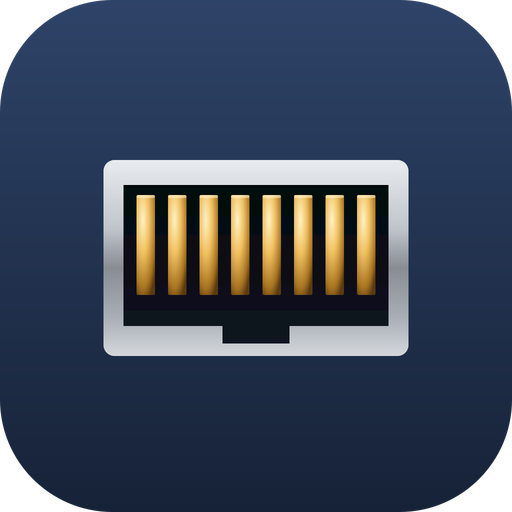

<p align="center">
  
</p>

<h1 align="center">PortFinder</h1>

[](https://github.com/packetThrower/PortFinder/actions/workflows/ci.yml)
[](https://github.com/packetThrower/PortFinder/releases/latest)
[](https://github.com/packetThrower/PortFinder/releases)
[](https://github.com/microsoft/winget-pkgs/tree/master/manifests/p/packetThrower/PortFinder)
[](Cargo.toml)
[](https://www.gpui.rs/)

## Minimum OS Versions

**macOS** (Apple Silicon and Intel)
[](#requirements)
[](#requirements)
[](#requirements)

**Windows** (x64 and ARM64)
[](#requirements)
[](#requirements)

**Linux** (amd64 and arm64)
[](#requirements)
[](#requirements)
[](#requirements)
[](#requirements)

Network switch port discovery tool. Captures CDP (Cisco Discovery Protocol), LLDP (Link Layer Discovery Protocol), and MNDP (MikroTik Neighbor Discovery Protocol) packets to identify what switch, port, and VLAN your device is connected to.

📖 **Docs:** <https://packetthrower.github.io/PortFinder/> · 📝 [**Changelog**](CHANGELOG.md)

> **4.x is the pure-Rust rewrite.** Zed's [gpui](https://www.gpui.rs/)
> replaces the Tauri 2 + Svelte 5 stack from the 3.x line, which is
> preserved on the [`tauri-version`](https://github.com/packetThrower/PortFinder/tree/tauri-version)
> branch. The capture engine (CDP / LLDP / MNDP parsers, BPF helper,
> pcap orchestration) ports across unchanged.

## What it does

1. Select a network interface (or sniff all)
2. Choose protocol: CDP (Cisco), LLDP (Aruba, HP, etc.), or MNDP (MikroTik)
3. Click Start and PortFinder captures the next discovery packet
4. Displays: Switch Name, Switch IP, Switchport, Native VLAN, Voice VLAN, MTU, Switch Model

## Result card

After a capture lands:

- **Click any value** to copy that one field to the clipboard.
- **Copy as JSON** copies the full result as `serde_json` pretty-printed output — same shape `portfinder capture --json` produces.
- **History (N)** opens a popover with the last 10 captures (session-scoped by default; opt-in disk persistence via the settings menu). Left-click an entry to restore it to the card; right-click to copy that entry as JSON.

## Keyboard shortcuts

| Action | macOS | Linux / Windows |
|---|---|---|
| Start / Stop capture | <kbd>⌘R</kbd> | <kbd>Ctrl</kbd>+<kbd>R</kbd> |
| Quit | <kbd>⌘Q</kbd> | <kbd>Alt</kbd>+<kbd>F4</kbd> |

## Settings

A hamburger menu in the title bar opens the settings panel:

- **Save capture history** — when on, the in-app history popover persists to `history.json` alongside `settings.json`. Default off; flipping the toggle off deletes the file (in-memory deque stays for the rest of the session).
- **Log level** — slider with three stops (Normal / Verbose / Trace). Applies live to every logger (GUI + any parallel CLI invocation). Default Normal (info-level).
- **Write debug log** — toggles file logging. Default off; the log file appears only after you flip the switch. Takes effect immediately, no relaunch.
- **About →** opens an in-popover sub-page with version, GitHub, GPL-3.0 license, and BPF helper / Npcap / capture-access status.
- **Settings folder** / **Log folder** buttons reveal the platform-conventional directories in your file manager.

Log file location per platform:

- macOS: `~/Library/Logs/PortFinder/portfinder.log` *(Console.app indexes it)*
- Linux: `~/.local/state/portfinder/portfinder.log`
- Windows: `%LOCALAPPDATA%\PortFinder\Logs\portfinder.log`

## CLI

The headless CLI shares the capture engine with the GUI. Run with no args to launch the GUI; pass a subcommand to use the CLI.

```bash
portfinder capture --interface en0 --protocol LLDP        # capture and print
portfinder capture --json                                  # machine-readable
portfinder list --with-ip                                  # interfaces with IPs
portfinder privileges                                      # diagnose access
portfinder --help                                          # see all options
```

Global flags work alongside any subcommand:

- `-v` / `-vv` — bump log verbosity to debug / trace
- `-q` — warnings + errors only
- `--log-file <PATH>` — override the platform-default log path for this invocation (process-scoped, doesn't touch persisted settings)

Press Ctrl+C to interrupt a running capture; a second press force-exits. The Homebrew cask, Scoop manifest, and Linux `.deb` / `.rpm` / `pacman` packages all expose `portfinder` on `PATH` so the commands above work from any shell on every platform.

## Install

### macOS — Homebrew

```bash
brew install --cask packetThrower/tap/portfinder
```

This pulls the `.dmg` from the latest release, drops `PortFinder.app` into `/Applications`, and symlinks the headless CLI to `$(brew --prefix)/bin/portfinder`. See the [tap README](https://github.com/packetThrower/homebrew-tap) for upgrade and uninstall details. Click **Install BPF Helper** in the app once for non-sudo capture.

For early access to alpha / beta / rc builds, install the parallel `@alpha` cask alongside stable:

```bash
brew install --cask packetThrower/tap/portfinder@alpha
```

### Windows — winget (preinstalled)

```powershell
winget install packetThrower.PortFinder        # full identifier
winget install portfinder                      # short moniker (same result)
```

winget is Microsoft's own package manager and ships built-in on Windows 10 1809+ and Windows 11. The MSI auto-resolves x64 or arm64 to your host, installs to `Program Files\PortFinder\`, registers `PortFinder` and `portfinder-cli` on `PATH`, and adds a Start menu shortcut. Silent install is the default (no SmartScreen prompt). winget carries **stable only** — for pre-release builds use Scoop below or [Releases](https://github.com/packetThrower/PortFinder/releases) directly.

Update with `winget upgrade packetThrower.PortFinder` (or `winget upgrade --all`); uninstall with `winget uninstall packetThrower.PortFinder`. You'll still need [Npcap](https://npcap.com/#download) installed for packet capture (winget can chain it: `winget install Insecure.Npcap` once).

### Windows — Scoop

```powershell
scoop bucket add packetThrower https://github.com/packetThrower/scoop-bucket
scoop install portfinder
```

Installs PortFinder and exposes `portfinder` on your `PATH` so `portfinder capture …` works from PowerShell. Update with `scoop update portfinder`; uninstall with `scoop uninstall portfinder`. Scoop also carries a parallel `portfinder-prerelease` manifest for the alpha / beta / rc channel — winget doesn't have a pre-release equivalent. You'll still need [Npcap](https://npcap.com/#download) installed for packet capture.

### All platforms — release artifacts

`.dmg` + `PortFinder-BPF-*.pkg` (macOS arm64 + amd64), `.deb` / `.rpm` / `.AppImage` / `.pkg.tar.zst` (Linux amd64 + arm64), and `-setup.exe` + `.msi` (Windows x64 + ARM64) on every [release](https://github.com/packetThrower/PortFinder/releases/latest).

## Requirements

- **libpcap** (Linux: `libpcap0.8`, macOS: included, Windows: [Npcap](https://npcap.com/))
- **Elevated privileges** for packet capture:
  - macOS: click **Install BPF Helper** in the app (one-time, prompts for admin password). The installer drops the helper binary under `/Library/Application Support/PortFinder/PortFinder BPF Helper` and registers a LaunchDaemon `io.github.packetThrower.PortFinder.BPFHelper`. In macOS System Settings → General → Login Items & Extensions the entry shows as **PortFinder BPF Helper**.
  - Linux: install the `.deb` / `.rpm` / `.pkg.tar.zst` (postinstall sets `CAP_NET_RAW`), or run as root.
  - Windows: install Npcap with **Allow non-administrators to capture** enabled, or run PortFinder as Administrator.

## Development

### Prerequisites

- [Rust](https://rustup.rs/) 1.80+ (stable). No Node / pnpm in the build path.
- Platform-specific:
  - Linux: `libpcap-dev libxkbcommon-dev libxkbcommon-x11-dev libwayland-dev libx11-dev libxcb1-dev libxcb-randr0-dev libxcb-xkb-dev libxcb-cursor-dev libxcb-shape0-dev libxcb-xfixes0-dev libxcb-render0-dev libfontconfig1-dev libfreetype-dev pkg-config`
  - macOS: Xcode command-line tools + `pkg-config` (via Homebrew)
  - Windows: [Npcap SDK](https://npcap.com/) on the `LIB` path

### Run

```bash
cargo run                             # debug build + launch GUI
cargo run -- capture --protocol lldp  # CLI mode (any subcommand → headless)
cargo build --release                 # production binary at target/release/PortFinder
```

The first `cargo build` compiles gpui's full dep graph (~830 crates) and takes a few minutes. Incremental builds are fast.

### Bundle locally

[cargo-packager](https://github.com/crabnebula-dev/cargo-packager) wraps the release binary into platform installers.

```bash
cargo install cargo-packager
cargo packager --release -f app -f dmg   # macOS
cargo packager --release -f deb          # Linux
cargo packager --release -f nsis         # Windows (NSIS .exe)
```

## Versioning

[SemVer](https://semver.org/) `MAJOR.MINOR.PATCH`. Version lives in `version.txt` and is propagated to `Cargo.toml`'s `[package].version` by `scripts/bump.mjs`. Major-version history:

- `4.x` — gpui rewrite (current `main`)
- `3.x` — Tauri 2 + Svelte 5 (`tauri-version` branch)
- `2.x` — Wails 2 + Go (`wails-version` branch)
- `1.x` — original Python (`python-legacy` branch)

```bash
node scripts/bump.mjs patch    # 4.0.0 -> 4.0.1
node scripts/bump.mjs minor    # 4.0.5 -> 4.1.0
node scripts/bump.mjs major    # 4.1.4 -> 5.0.0
node scripts/tag.mjs           # git tag + push (triggers GitHub release)
```

## Tech Stack

- **Capture:** Rust + [pcap](https://crates.io/crates/pcap) (libpcap / Npcap bindings) + [Tokio](https://tokio.rs/) for async + cancellation
- **UI:** [gpui](https://www.gpui.rs/) (Zed's GPU-accelerated UI framework) + [gpui-component](https://github.com/longbridge/gpui-component)
- **Bundler:** [cargo-packager](https://github.com/crabnebula-dev/cargo-packager) (`.dmg` / `.deb` / `.rpm` / `.AppImage` / `.pkg.tar.zst` / NSIS / WiX)

## License

[GNU General Public License v3.0 or later](LICENSE). Forks are
welcome; derivative works must stay open under the same license.
Commercial use is permitted but can't close the source.
