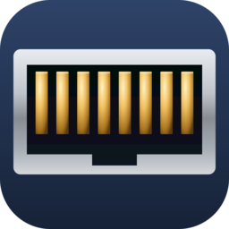
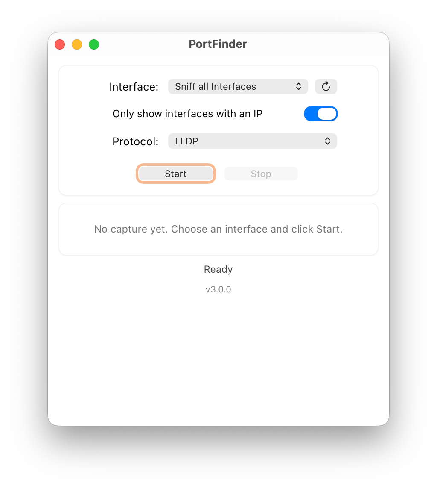
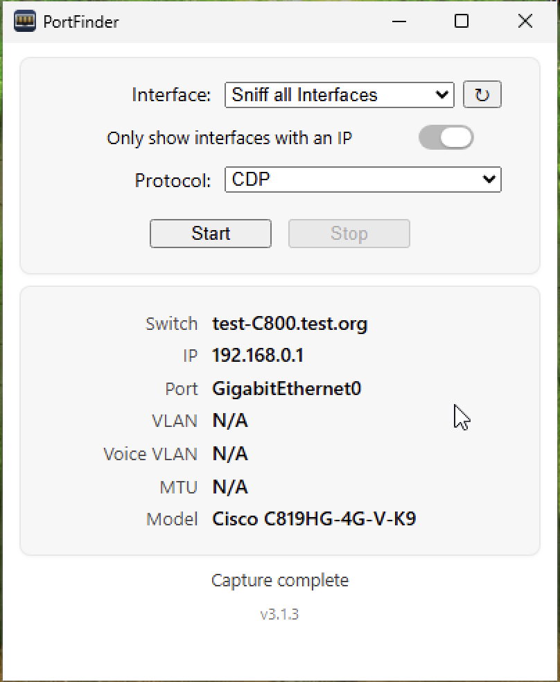
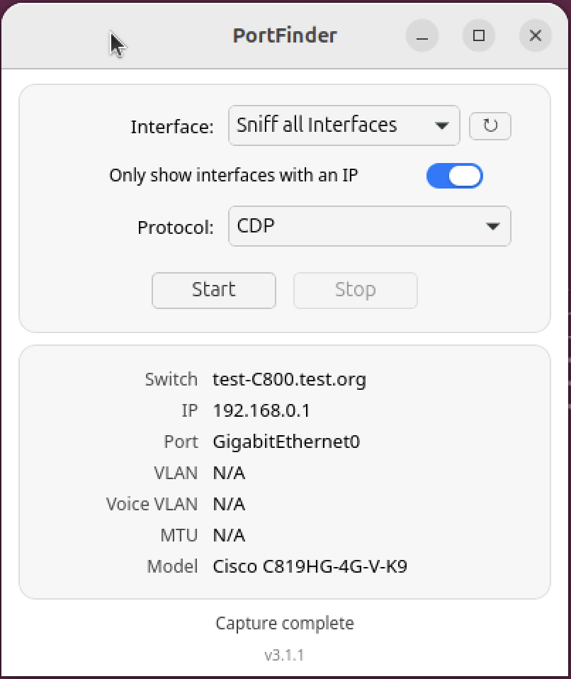
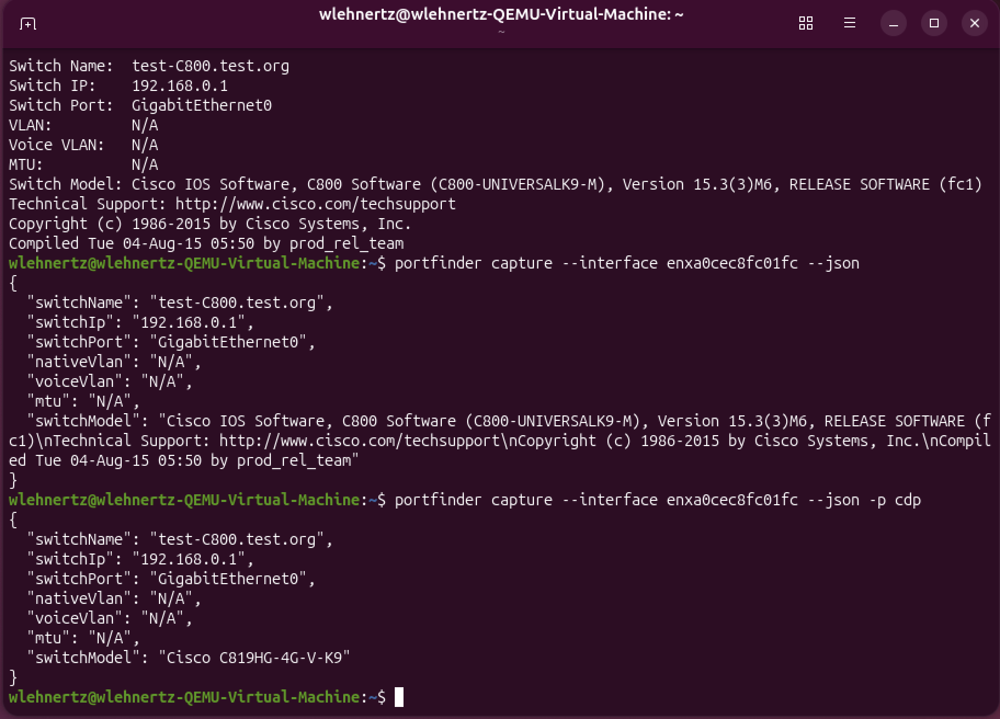

# PortFinder

  

Network switch port discovery tool. Captures **CDP** (Cisco Discovery Protocol), **LLDP** (Link Layer Discovery Protocol), and **MNDP** (MikroTik Neighbor Discovery Protocol) packets to identify what switch, port, and VLAN your device is connected to.

## What it does

1. Select a network interface (or sniff all)
2. Choose protocol — **CDP** (Cisco), **LLDP** (Aruba, HP, etc.), or **MNDP** (MikroTik)
3. Click **Start** and PortFinder captures the next discovery packet
4. Displays: Switch Name, Switch IP, Switchport, Native VLAN, Voice VLAN, MTU, Switch Model

## Screenshots

-   __macOS__

    ---

    

-   __Windows__

    ---

    

-   __Linux__

    ---

    

-   __CLI__

    ---

    

## At a glance

=== "GUI"

    Cross-platform desktop app on macOS, Windows, and Linux. Native widgets per platform.

=== "CLI"

    The same binary works headless. Use `portfinder capture --interface en0 --protocol LLDP` and pipe `--json` into your scripts.

## Get started

- :material-download: [**Install**](install.md) — `.dmg`, `.deb`, `.rpm`, `.AppImage`, `.exe`
- :material-cursor-default-click: [**GUI usage**](usage/gui.md)
- :material-console: [**CLI usage**](usage/cli.md)

## Source

Source on GitHub: [packetThrower/PortFinder](https://github.com/packetThrower/PortFinder)
